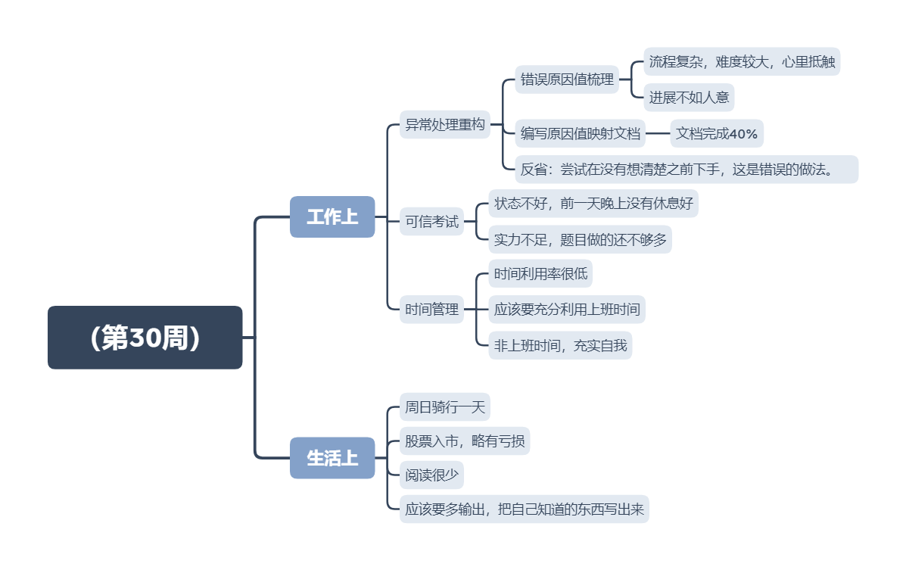

<h1 style="text-align:center">（第30周）</h1>

日期：2020/7/26

## 本周总结

本周最重要的一件事就是可信考试，然而可信考试并没有通过。有点自大，以为实力够了，没有认真复习，没想到最后翻车了，有点惭愧。

细节决定一切，不拖延。不了解的东西就要问，不能让问题在自己这里发酵。生活中也是一样的，能提前做的就一定不要拖到最后，这是大忌！

另外，不要指望别人帮你解决问题，别人无法设身处地的为你考虑，只有你考虑清楚了，可以请教别人是否可以，连选择都不要让别人做，而是自己权衡利弊后，知会他人。

本周日骑行60~70km，比较满意。锻炼身体，不可懈怠。

## 下周展望

- 自律！管好自己的时间
- 计划！管好要学习的任务