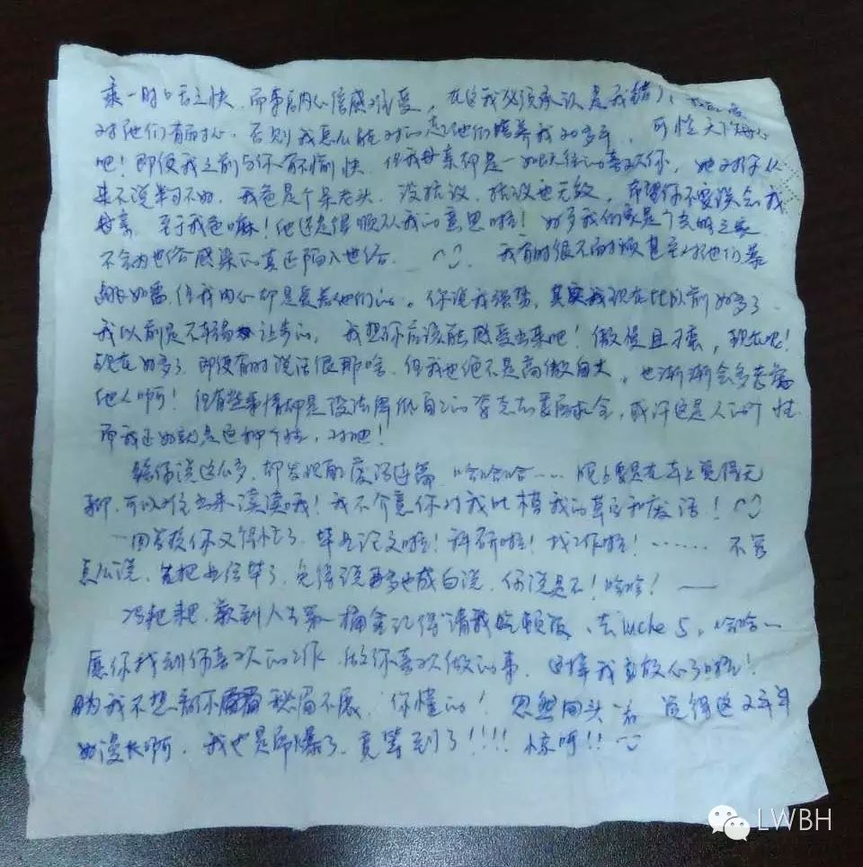

<h1 style="text-align:center">书信01</h1>

日期：2016/08/30

嘿，冯先生／冯粑粑／冯亲爱：

记得老早我就喜欢这样称呼你的哦！好像很喜欢给你写信，以至于我爱上这种给你写信的种种感觉。你呢？你是否每次阅读我的信都会特别开心呢？

人的一辈子并不是很长，比如爱一个人三年，人生并没有许多三年啊！而我也不知有多少个三年可以继续轮回，不过有生之年，爱还是要用尽力气的！兴趣爱好会将两个人的心牵在一起，是种奇幻之旅。古往今来，我所憧憬的爱情是如沈复先生的《浮生六记》中的点滴。是不是觉得我好傻，一个愿为爱而痴狂的天才美少女，哈哈～～～

这次生病让我看清楚了许多事，有痛有乐，没法一一陈述，因此只能是自知感受了。生命无常，能健全活下来，对我来说已经很不可思议了，将来还要孕育生命，只当是上帝无比眷顾我啦！哈哈哈～～～

有没有觉得我在纸上写信，没有一点文采可言呢？其实我也觉得如此，你也不要介意，日后还是一如既往的给你写邮件吧！

我在你心中也许并不算的上是好的，但应该算是较为独立的吧！哈哈～～我会继续保持独立的，只有这样我才觉得为人很有尊严，谁让我妈从小就灌输独立的思想呢！是吧！哈哈～～

还有就是，虽然我的爸妈不怎么样，但他们是爱我的，会给我想要的东西以及最好的。经过上次给你发了一次牢骚过后，我反省自己，觉得我还是喜欢逞一时口舌之快，而事后倍感难受。在这我必须承认是我错了，我应该对他们有耐心，否则我怎么能对得起他们培养我二十多年，可怜天下父母心吧！即便我之前与你有不愉快，但我母亲却是一如既往的喜欢你，她对你从来不说半句不好，我爸是个呆老头，没抗议，抗议也无效，希望你不要误会我母亲，至于我爸嘛！他还是顺从我的意思啦！好歹我家是个光明之家，不会为世俗感染的真正世俗。我有时很不耐烦甚至对他们暴跳如雷，但我内心是爱着他们的。你说我强势，其实我现在比以前好多了，我以前是不轻易让步的。我想你应该能感受出来吧！傲慢且刁蛮，现在呢！现在好多了，即便有时说话很那啥，但我也绝不是高傲自大，也渐渐会多考虑他人啊！但有些事情都是没法降低自己的姿态去委屈求全，或许这是人的个性，而我正好就是这种个性吧，对吧！

给你说这么多，却发现自己废话连篇，哈哈哈～晚上要是再车上无聊，可以拿出来读读哦！我不介意你对我吐槽我的草字和废话！

回学校你又得忙了，毕业论文啦！科研啦！找工作啦！....不管怎么说，先把业给毕了，免得说再多也成白说。你说是不啦！哈哈～

冯粑粑，赚到人生第一桶金记得请我吃顿饭，去uncle5，哈哈～～愿你找到你喜欢的工作，做你喜欢做的事，这样我就放心啦！因为我不想看你愁眉不展，你懂的！忽然回头一看，觉得两年半好漫长啊，我也是屌爆了，竟等到了！！惊讶！

天呀！废话太多，一张纸容不下了呀！没事，我继续写，等我在写完两张，你就差不多到了，对吧！

对了，跟你讲件事，我昨天在麦当劳吃了个椒盐鸡排，哇塞！真是超级好吃，外酥内嫩，比上海市人民广场的炸鸡好吃多了，我根本停不下来，现在又想吃了啊！我是个大胃王馋猫，刚吃完不久，又饿了！！！

是不是以后怀宝宝会吃的更多？这要感谢小恩养，哈哈，借他在肚子里生长为由，吃尽美食美味！想象都还是开心呀！恩，我不能放弃任何一个能吃的机会，毕竟我体重增不上也掉不下来啦！哈哈，么么哒！看到这，你是不是快睡了啊？也对，我这草字谁能看明白呢！只怪太软，要用力，我已经没什么力气了！！

冯亲爱，我忽然又想去长沙了！想吃臭豆腐哎！😢

我在想我的手机没电，跟你说我在永和豆浆里面，你能找到我吗？哇，有点不可思议！

我在打哈欠，好饿！现在不知道已经到了几点！难过！

哥哥，毕业后，我要带你去一个秘密地方，只有你和我知道，哈哈，到时候顺便送你一个礼物！至于是哪个地方，什么礼物，我也不知道，我随口说说，到时候就看我能不能记得哟！

恩，希望我不会让你觉得有压力！如果我不好，请你记得说出来；如果我又抗议，也请不要放心上，因为几遍当下我逞口舌之快，内心舒畅的不一定还是我！我是好了伤疤忘了疼，一个棒棒糖就能哄好的孩子。所以，你懂的！哈哈～～

废话太多，又好困，你咋还没来？我好担心你找不到我？

我爱你！

by LW

2016.8.30